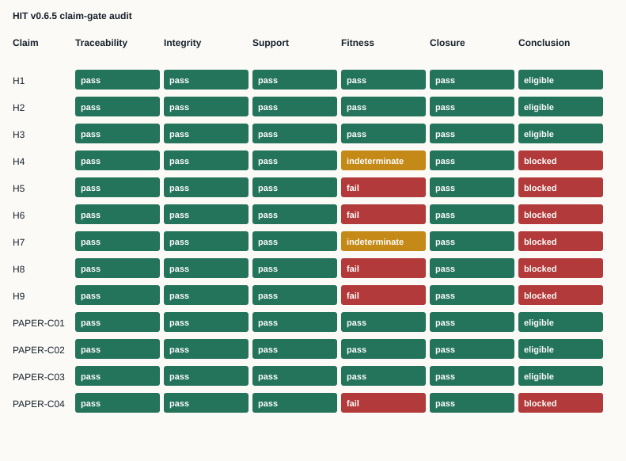

# Human Influence Telemetry: A Claim-Gated Documentary Method for AI-Mediated Institutional Decisions

## Abstract

Human-presence labels do not establish whether a person had evidence, exercised judgment, held practical authority, corrected error, repaired harm, or changed an AI-mediated decision architecture. Human Influence Telemetry (HIT) represents those questions as six substantive dimensions plus split Telemetry Integrity, with explicit findings for absence, ceremonial presence, substantive exercise, and insufficient evidence. This methods paper reports the open 0.4.0 normative contract, the separate 0.5.0 complete-record conformance engine, and one preserved human exercise under the earlier 0.1.0 scorer contract. Two eligible independent scorers agreed on 7 of 7 items for one frozen Cigna packet, with zero critical disagreements. That result covers one case, two scorers, and one category pattern; it does not estimate population reliability or resolve replication under the current contract. Version 0.6.5 adds a machine-readable claim-evidence map, five publication gates, eight negative controls, lineage records, and reproducible claim-gate figures. The audit reaches `PASS_WITH_EXCEPTIONS`: six mapped claims may enter a conclusion, while causal, legal, adoption, outcome, clean-room, and current-contract replication claims remain blocked.

## 1. Problem

Institutional records can document that a person appeared in a workflow while leaving the person's influence unresolved. A signature, review step, or escalation label supplies weak evidence when records omit access to underlying evidence, independent judgment, practical command, correction, repair, or reform. HIT treats that gap as a documentary measurement problem.

The research question is bounded: can an open machine-readable method distinguish substantive influence, ceremonial presence, affirmative absence, and insufficient evidence while keeping empirical conclusions inside the available record?

## 2. Method

HIT defines Counsel, Judgment, Command, Correction, Repair, and Reform as substantive dimensions. Telemetry Integrity separately evaluates process coverage and packet integrity. The 0.4.0 contract assigns `0` only when affirmative evidence establishes absence, `1` when process-specific evidence establishes ceremonial presence, `2` when records establish exercise or qualifying operational capability, and `IE` when evidence remains insufficient. `IE` is not converted to zero or averaged into an ordinal total.

The 0.5.0 engine checks complete assessment records against the contract. It adds executable rejection behavior without changing the scoring semantics. Synthetic boundary fixtures test the declared rules. These fixtures establish deterministic implementation behavior. They do not establish empirical correctness.

Version 0.6.5 adds a publication-control layer. Thirteen mapped claims receive traceability, integrity, human support review, evidence fitness, and dependency-closure gates. Evidence fitness separates directness, contemporaneity, independence, completeness, and publication authority. A claim enters the conclusion only when its status is supported, every required gate passes, and every dependency is eligible.

## 3. Bounded human result

The preserved 0.6.0 release reports one locked exercise under scorer contract 0.1.0. Two eligible independent scorers assessed one frozen Cigna packet. They produced 7 of 7 exact agreements and zero critical disagreements. Both assigned `1` to the six substantive dimensions and `limited` to Telemetry Integrity. Cohen's kappa is undefined because the six substantive ratings contain no category variance.

This result establishes agreement for the named packet, scorers, items, protocol, and contract. The active 0.4.0 replication protocol remains a separate candidate. Its case selection, packet freeze, recruitment, and scoring gates remain unresolved, and v0.6.5 adds no external-rater evidence.

## 4. Research-integrity audit

The audit resolves exact evidence locators, checks tracked or digest-protected integrity, records author support review, computes five fitness dimensions, and closes claim dependencies. Eight in-memory negative controls test missing references, weakened integrity, removed support review, failed fitness, unresolved dependencies, false eligibility, missing locators, and a current-contract replication overclaim.

All eight corruptions are expected to produce validation errors. The resulting `PASS_WITH_EXCEPTIONS` state permits bounded structural, executable, component-boundary, human-result-boundary, and audit-behavior claims. It blocks H4, H5, H6, H7, H8, H9, and PAPER-C04 from the conclusion.

## 5. Limitations

The empirical result contains one retrospective insurance case, two scorers, seven items, one category pattern, and the preserved 0.1.0 scorer contract. Public records may omit internal access, authority, and correction. Author-scored historical cases remain version-bound. Synthetic fixtures test declared behavior, and negative controls test audit sensitivity to specified corruptions; neither test source truth or field validity.

The responsible author supplied the v0.6.5 support and fitness judgments. No independent assessor reproduced those judgments. The literature search and novelty audit remain incomplete. HIT has no recorded independent institutional adoption, completed clean-room implementation result, preregistered outcome study, or qualified legal conformity review.

## 6. Conclusion

HIT supplies an open documentary contract that represents six substantive dimensions and split Telemetry Integrity, an executable conformance layer that preserves the contract boundary, and one bounded independent human result. The v0.6.5 publication controls connect mapped claims to exact evidence and block conclusions when support, fitness, or dependencies remain unresolved. The available evidence supports a methods and artifact contribution. Current-contract external-rater replication, causal effectiveness, legal conformity, population reliability, independent adoption, and field validity remain unresolved.
